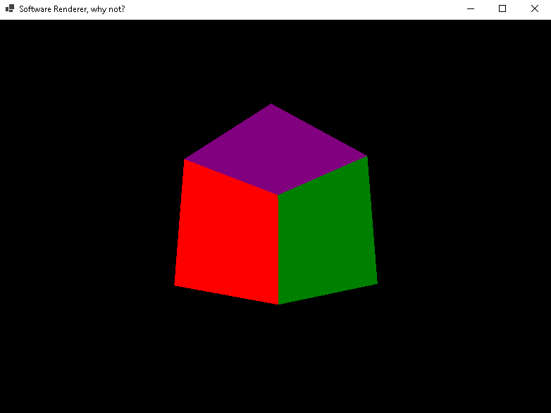

# Software Renderer

A pure C# 3D renderer built from scratch. No OpenGL, no DirectX, or Vulkan. just math and CPU.

It projects 3D vertices onto a 2D grid of integers (your screen) using barycentric coordinate rasterization.



## Features

- **Zero Deps:** Only uses standard .NET libraries.
- **SIMD:** Uses `System.Numerics` for high-performance matrix and vector math.
- **Multithreaded:** The rasterizer uses `Parallel.For` to split rendering across all CPU cores.
- **Z-Buffering:** Proper depth testing so faces don't overlap incorrectly.
- **Single File:** Compiled into a standalone executable with zero extra DLLs, yea, I love this C# thing.

## How to Build

Since this project is simple, you should publish it using the following command. This will bundle the .NET runtime into the EXE and strip out unused code.

```bash
dotnet publish -c Release -r win-x64 --self-contained true /p:PublishSingleFile=true
```

The final executable will be located in:
`bin/Release/net10.0-windows/win-x64/publish/SoftwareRenderer.exe`

## How it Works

1. **Buffer:** A raw `int[]` array holds the color of every pixel.
2. **Math:** A 4x4 Matrix transforms 3D points into "Clip Space."
3. **Rasterizer:** For every triangle, the code calculates the bounding box and checks every pixel inside it. If a pixel is inside the triangle, it calculates the depth (Z) and updates the pixel color if it's closer than the previous one.
4. **Display:** I use `LockBits` to copy our raw integer array directly into Windows memory for high-speed rendering.

## Performance

- If you add more complex models, the `Parallel.For` in the triangle loop is your best friend.

## Planned

- I want to create a basic .obj reader so I can render a more complex model later.

## License

MIT - Do whatever you want with it.
